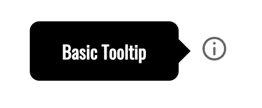
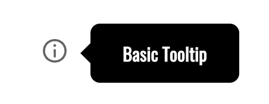
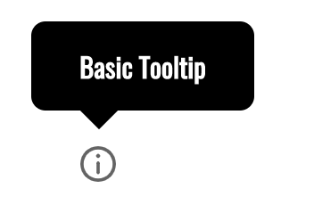
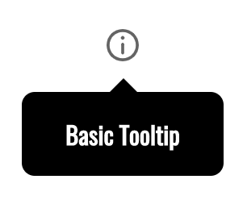
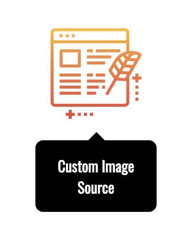
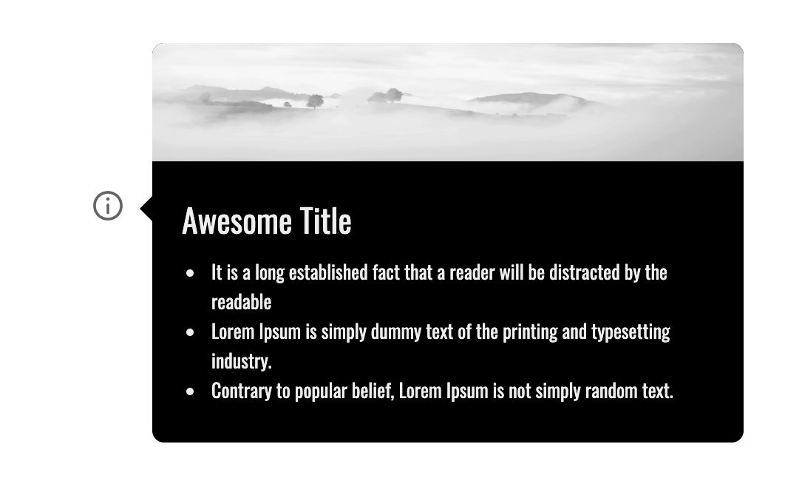

![Built With Stencil](https://img.shields.io/badge/-Built%20With%20Stencil-16161d.svg?logo=data%3Aimage%2Fsvg%2Bxml%3Bbase64%2CPD94bWwgdmVyc2lvbj0iMS4wIiBlbmNvZGluZz0idXRmLTgiPz4KPCEtLSBHZW5lcmF0b3I6IEFkb2JlIElsbHVzdHJhdG9yIDE5LjIuMSwgU1ZHIEV4cG9ydCBQbHVnLUluIC4gU1ZHIFZlcnNpb246IDYuMDAgQnVpbGQgMCkgIC0tPgo8c3ZnIHZlcnNpb249IjEuMSIgaWQ9IkxheWVyXzEiIHhtbG5zPSJodHRwOi8vd3d3LnczLm9yZy8yMDAwL3N2ZyIgeG1sbnM6eGxpbms9Imh0dHA6Ly93d3cudzMub3JnLzE5OTkveGxpbmsiIHg9IjBweCIgeT0iMHB4IgoJIHZpZXdCb3g9IjAgMCA1MTIgNTEyIiBzdHlsZT0iZW5hYmxlLWJhY2tncm91bmQ6bmV3IDAgMCA1MTIgNTEyOyIgeG1sOnNwYWNlPSJwcmVzZXJ2ZSI%2BCjxzdHlsZSB0eXBlPSJ0ZXh0L2NzcyI%2BCgkuc3Qwe2ZpbGw6I0ZGRkZGRjt9Cjwvc3R5bGU%2BCjxwYXRoIGNsYXNzPSJzdDAiIGQ9Ik00MjQuNywzNzMuOWMwLDM3LjYtNTUuMSw2OC42LTkyLjcsNjguNkgxODAuNGMtMzcuOSwwLTkyLjctMzAuNy05Mi43LTY4LjZ2LTMuNmgzMzYuOVYzNzMuOXoiLz4KPHBhdGggY2xhc3M9InN0MCIgZD0iTTQyNC43LDI5Mi4xSDE4MC40Yy0zNy42LDAtOTIuNy0zMS05Mi43LTY4LjZ2LTMuNkgzMzJjMzcuNiwwLDkyLjcsMzEsOTIuNyw2OC42VjI5Mi4xeiIvPgo8cGF0aCBjbGFzcz0ic3QwIiBkPSJNNDI0LjcsMTQxLjdIODcuN3YtMy42YzAtMzcuNiw1NC44LTY4LjYsOTIuNy02OC42SDMzMmMzNy45LDAsOTIuNywzMC43LDkyLjcsNjguNlYxNDEuN3oiLz4KPC9zdmc%2BCg%3D%3D&colorA=16161d&style=for-the-badge)


[](https://github.com/Paraboly/pwc-tooltip)


[](https://www.npmjs.com/package/@paraboly/pwc-tooltip)
[](https://www.npmjs.com/package/@paraboly/pwc-tooltip)

[](https://opensource.org/licenses/MIT)


# [Live CodePen Example](https://codepen.io/wrathchaos/pen/jOOBKqr)

</br>

## Basic Tooltip Screenshots 

<p align="center">
  
  
  
  
</p>

## Custom Image Screenshot

<p align="center">
  
</p>


## Custom Slot (Children) Screenshot (Your own design)

<p align="center">
  
</p>


## Installation

### Script tag

- Put a script tag similar to this `<script	type="module" src="https://unpkg.com/@paraboly/pwc-tooltip@0.0.1/dist/pwc-tooltip/pwc-tooltip.esm.js"></script>` in the head of your index.html
- Then you can use the element anywhere in your template, JSX, html etc

### Node Modules
- Run `npm install @paraboly/pwc-tooltip --save`
- Put a script tag similar to this `<script src='node_modules/@paraboly/pwc-tooltip/dist/pwc-tooltip.js'></script>` in the head of your index.html
- Then you can use the element anywhere in your template, JSX, html etc

### In a stencil-starter app
- Run `npm install @paraboly/pwc-tooltip --save`
- Add an import to the npm packages `import @paraboly/pwc-tooltip;`
- Then you can use the element anywhere in your template, JSX, html etc


# Usage

## Basic Tooltip Usage

```html
<pwc-tooltip
    tooltip-alignment="bottom"
    tooltip-text="Basic Tooltip"
></pwc-tooltip>
```

## Custom Image Tooltip Usage

```html
<pwc-tooltip
  source-width="100"
  source-height="100"
  tooltip-alignment="bottom"
  tooltip-text="Custom Image Source"
  tooltip-source="../../assets/blog.svg"
>
</pwc-tooltip>
```

## Custom Children Design (Slot) Usage

```html
<pwc-tooltip
  tooltip-alignment="right"
  tooltip-text=""
  background-color="transparent"
>
  <div class="container">
    
    <div class="content-style">
      <h3 class="h3-style">
        Awesome Title
      </h3>
      <ul class="ul-style">
        <li>
          It is a long established fact that a reader will be distracted by
          the readable
        </li>
        <li>
          Lorem Ipsum is simply dummy text of the printing and typesetting
          industry.
        </li>
        <li>
          Contrary to popular belief, Lorem Ipsum is not simply random text.
        </li>
      </ul>
    </div>
  </div>
</pwc-tooltip>
```

## Authors

FreakyCoder, kuray.ogun@paraboly.com | kurayogun@gmail.com

## License

WebComponent PWC PWC Tooltip is available under the MIT license. See the LICENSE file for more info.
